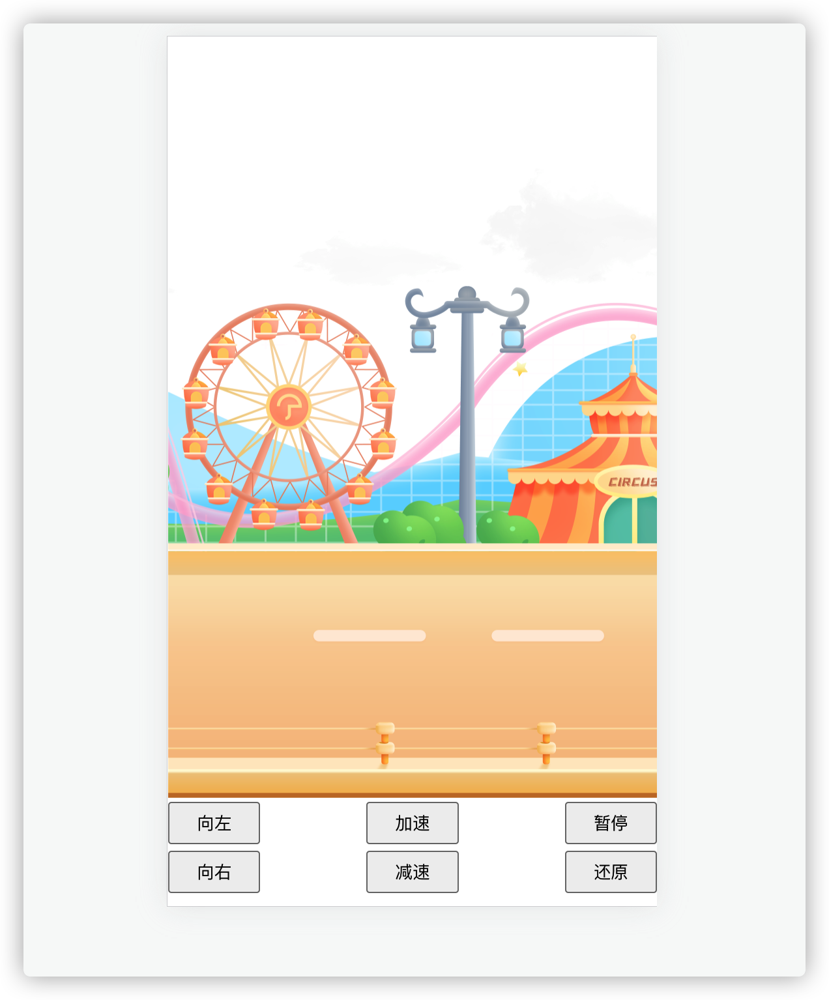

# vue2-move-image

[](https://www.npmjs.com/package/vue-move-image)
[](https://www.npmjs.com/package/vue-move-image)
[](https://github.com/CNLHB/move-image/stargazers)  
图片横向无缝滚动, Chrome & more with Vue.js(vue2.x).  
欢迎点个star🎉🎉🎉	



## [Live demo](https://cnlhb.github.io/move-image/build/index.html)

## Installation

### NPM

```bash
$ npm install vue-move-image
```

### ES6

```
import Vue from 'vue'
import MoveImage from 'vue-move-image'
Vue.use(MoveImage)

```

or

```

import MoveImage from 'vue-move-image'
export default {
  name: 'App',
  components: {
    MoveImage,
  },
}

```

## Props

### Props of ColorPicker

| Name    | Type   | Default                                                      | Description                                                  |
| ------- | ------ | ------------------------------------------------------------ | ------------------------------------------------------------ |
| options | object | {<br />width: '560px',<br />height: '484px',<br />autoplay: true,<br />speed: 5,<br />stage: 1,<br />max: 15,<br />direction: 'left'<br />} | 配置项,图片宽高，<br />是否自动播放，初速度，最大速度，调速大小 |
| imgs    | array  | []                                                           | 图片地址数组[url1,url2]                                      |
|         |        |                                                              |                                                              |

### example

```vue
<template>
  <div id="app">
    <!-- <div class="bg_img"></div> -->
    <div class="img_box" >
      <MoveImg ref="moveImgRef"  :imgs="imgs" :options="options"/>
    </div>
     <div class="box">
      <div class="box_btnBox">
        <button class="leftBtn" @click="toLeft">向左</button>
         <button class="addSpeedBtn" @click="addSpeed">加速</button>
        <button class="stopBtn" @click="stop">暂停</button>
      </div>
      <div class="box_btnBox">
        <button class="rightBtn" @click="toRight">向右</button>
        <button class="subSpeedBtn" @click="subSpeed">减速</button>
        <button class="restoreBtn" @click="reset">还原</button>
      </div>
    </div>
  </div>
</template>

<script>
import MoveImg from './components/MoveImage.vue'

export default {
  name: 'App',
  components: {
    MoveImg
  },
  data() {
    return {
      moveImgRef: null,
      imgs: [require('./assets/方案一/背景动.png')],
      options: {
        max: 100,
        stage: 5,
        speed: 5,
        autoplay: true,
        width: '560px',
        height: '484px'
      }
    }
  },
  mounted(){
      this.moveImgRef = this.$refs.moveImgRef

  },
  methods: {
    start() {
      console.log(this.moveImgRef);
      this.moveImgRef.start()
    },
    stop() {
      this.moveImgRef.stop()
    },
    addSpeed() {
      this.moveImgRef.addSpeed()
    },
    subSpeed() {
      this.moveImgRef.subSpeed()
    },
    toLeft() {
      this.moveImgRef.toLeft()
    },
    toRight() {
      this.moveImgRef.toRight()
    },
    reset() {
      this.moveImgRef.reset()
    },
  }
  
}
</script>

<style lang="scss">
html,body {
  margin: 0;
  padding: 0;
}
#app {
  font-family: Avenir, Helvetica, Arial, sans-serif;
  -webkit-font-smoothing: antialiased;
  -moz-osx-font-smoothing: grayscale;
  text-align: center;
  color: #2c3e50;
  position: relative;
}
.bg_img{
  position: absolute;
  top: 0;
  // background: url('./assets/方案一/背景不动.png') no-repeat;
  // background-size: 100% 100%;
  // width: 100%;
  // height: 477px;
}

.img_box{
  width: 100%;
  height: 500px;
  top: 100px;
  position:relative;
}
.box{
  position: fixed;
  bottom: 10px;
  width: 100%;
  overflow: hidden;
  z-index: 99;
}
      .box_btnBox {
        width: 100%;
        display: flex;
        align-items: center;
        justify-content: space-between;
        flex-wrap: wrap;
        margin-top: 5px;
      }
      .box_btnBox button {
        padding: 5px 20px;
      }
</style>

```

## Local setup

### Compiles and hot-reloads for development

```
yarn serve
```

### Compiles and minifies for lib

```
yarn lib
```

### Lints and fixes files

```
yarn lint
```

### Customize configuration

See [Configuration Reference](https://cli.vuejs.org/config/)
